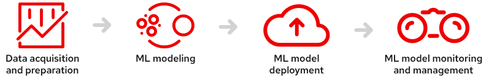
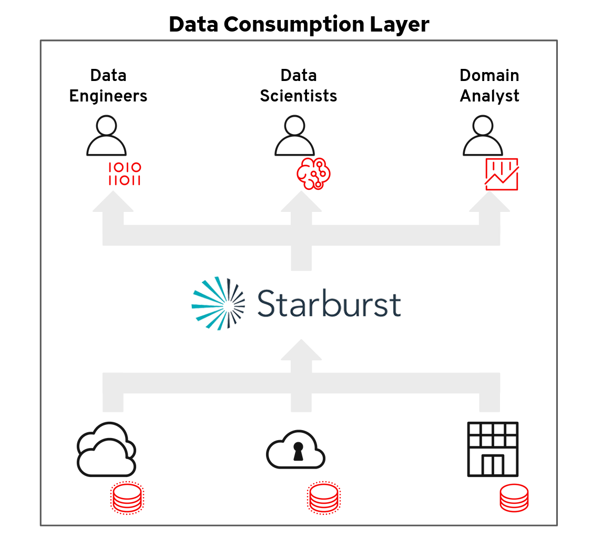
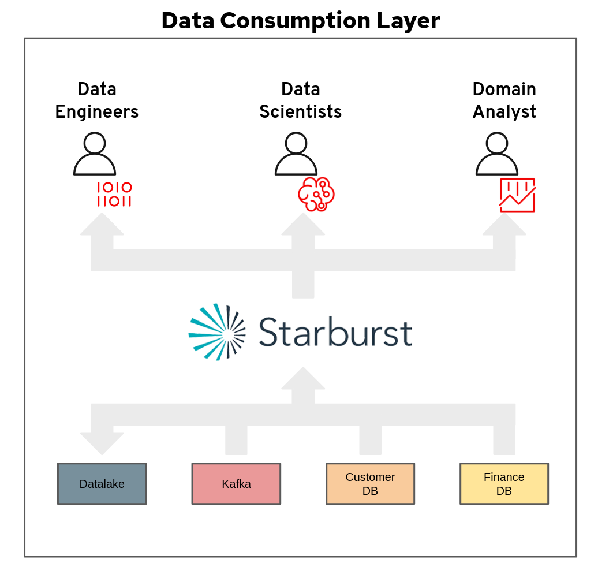

# chatbot-kafka-consumer
## Introduction
**Red Hat OpenShift Data Science**, a managed cloud platform for Data Scientists
and Developers of intelligent applications, supports the full Machine Learning
lifecycle by providing a robust, scalable platform and a flexible, interactive
environment for teams to do their work. **Starburst Galaxy**, based on open
source Trino (formerly PrestoSQL), is a managed service providing a single point
of access to your data without having to move it to a central repository.
**Starburst Galaxy** focuses on the first, and often most difficult problem
teams face when starting a new project - **The Acquisition and Preparation of
Data**.

**Figure:** Machine Learning Lifecycle

**Figure:** High level view of Starburst's Data Consumption Layer

## Demonstration
This demonstration will illustrate how quickly a Data Scientist can join
streaming data from a **Customer Support Chatbot** to both the **Customer** and
**Financial** data domains in relational databases. This process is
straightforward thanks to **Starburst Data's** data consumption layer
abstractions. 

## High Level Architecture 

## Requirements
Please see [chatbot-env-setup](https://github.com/keklundrh/chatbot-env-setup)
for instructions to create a comparable demo environment. 

You will need:
- [A Kafka
  queue](https://www.redhat.com/en/technologies/cloud-computing/openshift/openshift-streams-for-apache-kafka)
- PostgreSQL with staged data (Customer domain)
- PostgreSQL with staged data (Finance domain)
- Hive metastore 
- Jupyter notebooks (this repo)  

## Getting Started
